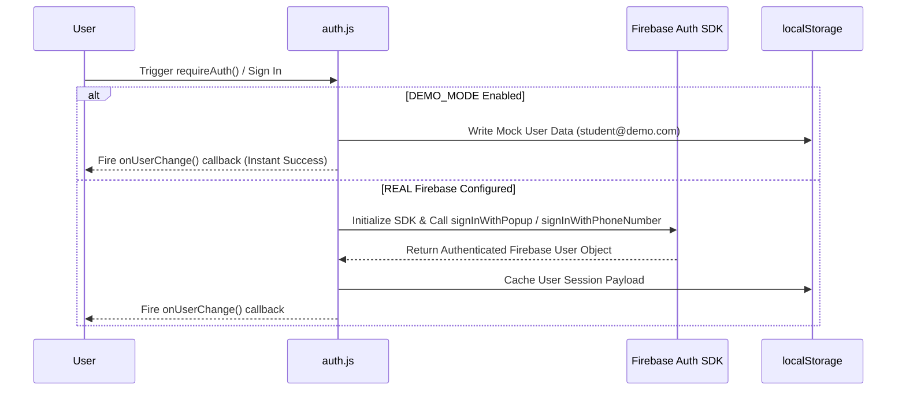
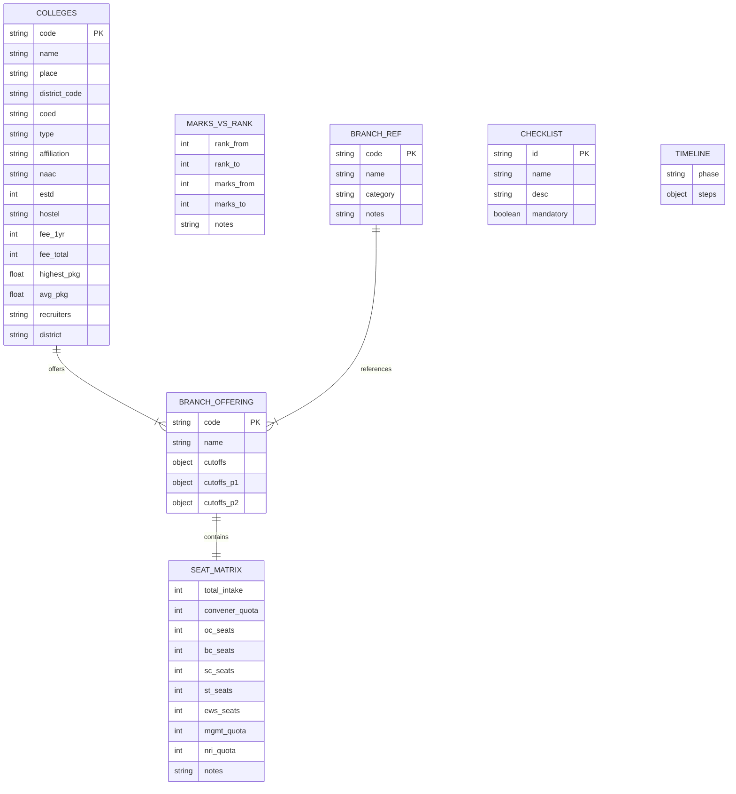
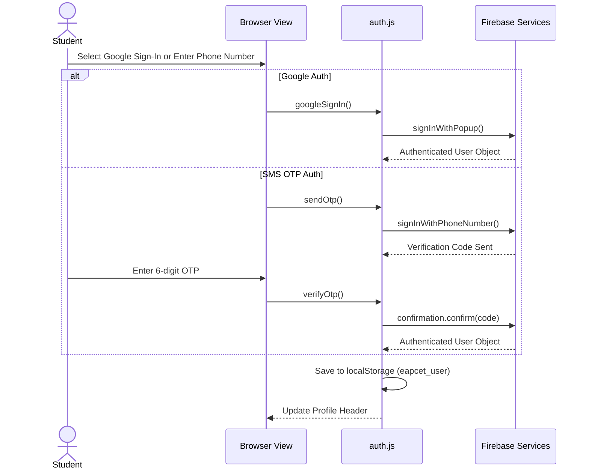
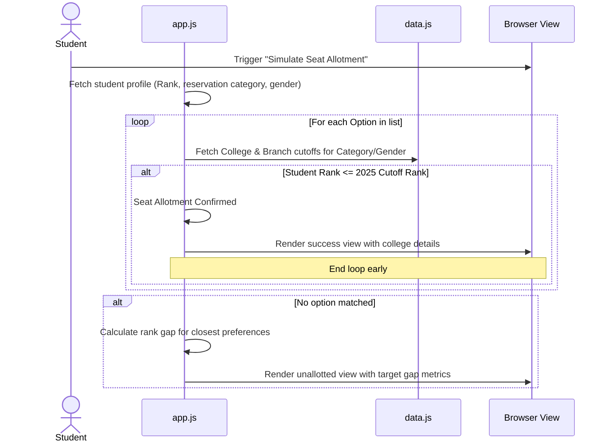

# MarsMate TS-EAPCET 2026 Codebase Documentation

This document provides a comprehensive technical overview and architectural guide to the MarsMate TS-EAPCET 2026 College Predictor & Counselling Companion codebase.

---

# 1 Project Overview

*   **Project Name:** MarsMate TS-EAPCET 2026 College Predictor & Counselling Companion
*   **Purpose:** An interactive single-page application (SPA) designed to assist students navigating the Telangana EAPCET (Engineering, Agriculture, and Medical Common Entrance Test) 2026 admissions cycle. It enables candidates to predict admission outcomes based on rank or marks, organize preferred options, simulate seat allotments, check fee reimbursement statuses, and verify necessary document checklists.
*   **Tech Stack:**
    *   **Languages:** HTML5, CSS3, JavaScript (ES6 Modules), Python (Data Pipelines)
    *   **Frameworks:** None (Pure Vanilla frontend design)
    *   **Libraries:** Vercel Analytics (optional dependency)
    *   **Runtime:** Node.js (for serving/compilation utilities)
    *   **Build System:** Python ETL scripts compiling database CSVs directly into ES Modules.
    *   **Dev Server:** `npx serve -s .`

---

# 2 Repository Structure

The complete repository file tree is mapped below:

```text
ts-eapcet-college-predictor/
├── .git/
├── .gitignore
├── LICENSE
├── README.md
├── index.html                    # Main application GUI & layout template
├── app.css                       # Global styling sheet & premium design system tokens
├── app.js                        # Primary application controller and domain logic
├── auth.js                       # Firebase & localStorage Identity wrapper
├── analytics.js                  # Local/Remote telemetry event logging
├── stats.js                      # Live application statistics tracker
├── data.js                       # Compiled static in-memory data tables (2.5 MB)
├── process_data.py               # Principal Python ETL compiler script
├── compare_colleges.py           # Verification script comparing CSV entries against data.js
├── extract_colleges.py           # PDF parsing utility extracting colleges from EAPCET guides
├── find_new_colleges.py          # Differential checker verifying PDF text against data.js
├── read_notification.py          # PDF diagnostic script analyzing official schedules
├── fix_packages.py               # Placement/recruiter patch manager (V1)
├── fix_packages_v2.py            # JSON-deserialization placement patch manager (V2)
├── fix_packages_node.mjs         # Node ESM equivalent script to patch placement data
├── favicon.png
├── package.json
├── package-lock.json
├── tg branch total list.pdf       # Reference document
├── admin/
│   ├── analytics.html            # Admin dashboard client layout
│   └── analytics.js              # Admin portal stats renderer
├── main data/
│   ├── TGEAPCET2026DETNOTIFICATION (2).txt
│   ├── TGEAPCET_2025_FINALPHASE_LASTRANKS (2).csv
│   ├── TGEAPCET_2025_LASTRANKS_FirstPhase.csv
│   ├── TGEAPCET_2025_LASTRANKS_SecondPhase.csv
│   ├── article_careers360_20260619013902 (2).txt
│   └── table-eapcet.txt          # Placement raw details (Highest pkg, avg pkg, recruiters)
├── ts eapcet data/
│   ├── 01_College_Master_List_2026.csv
│   ├── 02_Branch_Code_Reference.csv
│   ├── 03_EAPCET_2025_Cutoff_Ranks_Reference.csv
│   ├── 04_Category_Seat_Matrix.csv
│   ├── 05_Certificate_Verification_Checklist_2026.txt
│   ├── 06_Counselling_Schedule_2026_Indicative.txt
│   └── 07_Marks_vs_Rank_Reference.csv
└── scratch/                      # Playback and unit testing scripts
    ├── check_table.py
    ├── inspect_alignment.py
    ├── inspect_colleges.py
    ├── inspect_indices.py
    ├── match_codes.py
    ├── test_recruiter_parser.py
    └── test_regex.py
```

### Top-Level Folder Explanations
*   `admin/`: Holds the administrative panel layouts and JavaScript controller that exposes real-time dashboard data by consuming events saved locally or fetched from the Firebase Realtime Database.
*   `main data/`: Holds the raw historical cutoff lists (Phases 1, 2, and Final) along with raw placements/fees lists (`table-eapcet.txt`) compiled by scraping Careers360 or news publications.
*   `ts eapcet data/`: Holds cleaned state matrices, checklists, marks-vs-rank tables, and master college spreadsheets parsed by Python pipelines.
*   `scratch/`: Contains temporary diagnostic files used to run tests on Regex rules, formatting configurations, and index alignment.

---

# 3 Architecture

```mermaid
graph TD
    subgraph ETL Compilation Phase (Offline)
        CSVs[CSV/TXT Reference Data] --> PythonCompiler[process_data.py]
        PythonCompiler --> JSData[data.js]
    end

    subgraph Client-Side Architecture (Runtime)
        JSData -->|Import Arrays| AppJS[app.js]
        StatsJS[stats.js] -->|Track Telemetry| AppJS
        AnalyticsJS[analytics.js] -->|Event logs| AppJS
        AuthJS[auth.js] -->|Inject State| AppJS

        AppJS -->|Manipulate DOM| HTML[index.html]
        AppJS -->|Store state| LocalStorage[(Browser LocalStorage)]
        
        AuthJS -.->|Optional SDK Auth| FirebaseAuth[Firebase Auth]
        StatsJS -.->|Optional RTDB Sync| FirebaseDB[Firebase RTDB]
        AnalyticsJS -.->|Optional Event Sync| FirebaseDB
    end
```

### Architecture Patterns & Design Decisions
*   **Decoupled Client-Side Engine:** All operations (such as seat prediction S-curves, fee calculations, rank interpolations, and sorting) run in-memory inside the client browser. No custom web server is required.
*   **Static Data Bundling:** Reference datasets are loaded upfront from `data.js` (approx. 2.5 MB containing thousands of records). This yields instantaneous client response speeds.
*   **Fallback Local Persistence:** State management (checklists, option order selections) resides in client `localStorage`. Authentication switches dynamically to "Demo Mode" using `localStorage` mocks when Firebase keys are omitted.
*   **Event-Driven UI Updates:** Vanilla event listeners bind form state modifications directly to DOM re-renders without high-overhead frameworks.

---

# 4 Features

### 1. Student Profile Configurator
*   **Description:** Gathers basic candidate parameters used across all calculators.
*   **Inputs:** Rank or Marks (interpolates predicted rank via `estimateRank()`), Reservation Category (OC, BC, SC, ST, EWS), Gender (Boys/Girls/General), Region Eligibility (OU Local/Non-Local), Annual Family Income, TS Study history.
*   **APIs/Services:** Local state mapping.

### 2. Live Admission Chance Engine
*   **Description:** Evaluates individual college branch options relative to student rank using historical 2025 cutoffs.
*   **Chances Classified:** `Safe Pick` (ratio ≤ 0.8), `Good Bet` (ratio ≤ 1.0), `Borderline` (ratio ≤ 1.15), and `Reach` (ratio > 1.15).
*   **Projected YoY S-Curve (2026 Predictions):** Projects 2026 outcomes by adjusting cutoffs through branch-specific market factors (e.g., CSE compressions vs. Civil extensions).

### 3. Automated Option Form Builder
*   **Description:** Students select and rank choice combinations, which are reordered using drag-and-drop or manual up/down controls.
*   **Preference Modes:**
    *   *College-First:* Auto-populates selections with top colleges first, allocating branch preferences within them.
    *   *Branch-First:* Group by branch first (e.g., CSE across all colleges, followed by ECE).

### 4. In-Memory Allotment Simulator
*   **Description:** Iterates through user-compiled option lists to mock realistic EAPCET seat allotments using convenience quota limits.
*   **Business Rules:** First option matching the candidate's rank and reservation category is allotted. Displays distance/gap metrics for missed choices.

### 5. Fee Reimbursement Calculator
*   **Description:** Determines fee waivers under government rules based on student inputs.
*   **Waiver Levels:** "Eligible (Full)" for ranks ≤ 10,000, "Eligible (₹35k/yr)" for private colleges, or "Partial TSSP" rules. Generates a 4-year budget summary (tuition, hostel, mess fees).

### 6. Verification Checklist & Timeline
*   **Description:** Toggles checklist item states, links official MeeSeva/TGEAPCET download portals, and runs a countdown timer to upcoming EAPCET milestones.

---

# 5 Authentication

The authentication model resides in `auth.js` and works as follows:



*   **Middleware Guards:** The `requireAuth(callback)` function serves as a client-side route/action guard. If the user session object is empty, the login modal is opened.
*   **RBAC & Permissions:** Flat student structure. The client-side admin page evaluates if the host is `localhost` or if an authenticated session exists before loading the data dashboard.

---

# 6 Database

The application does not use an external SQL/NoSQL engine. Data acts as a static client-side database in `data.js`.

### Data Schema Representation


---

# 7 APIs

No backend API is hosted. All API calls are client-to-service integrations:

*   **Authentication (Google/Phone Auth):** Google API endpoint `https://www.gstatic.com/firebasejs/10.12.2/firebase-auth.js`
*   **Realtime Statistics DB:** Firebase RTDB endpoint path `stats/`
*   **Realtime Event Tracking:** Firebase RTDB endpoint path `events/`
*   **External Downloads Links:** MeeSeva (`ts.meeseva.telangana.gov.in`) and TG EAPCET (`eapcet.tgche.ac.in`)

---

# 8 Environment Variables

No `.env` file exists inside the workspace. The code uses hardcoded config placeholders in `auth.js` and `stats.js` for easier client-side deployment:

*   `FIREBASE_CONFIG.apiKey`: Google Firebase API Project Key.
*   `FIREBASE_CONFIG.authDomain`: Firebase project authentication routing domain.
*   `FIREBASE_CONFIG.projectId`: Unique target ID of the Google Firebase project.
*   `FIREBASE_CONFIG.storageBucket`: Firebase asset storage bucket identifier.
*   `FIREBASE_CONFIG.messagingSenderId`: Sender token identifier for push alerts.
*   `FIREBASE_CONFIG.appId`: Application tracking client key.
*   `RTDB_URL`: Firebase Realtime Database URL used to update global usage statistics.

---

# 9 Third-Party Services

1.  **Google Firebase Auth:** Identity provider for Google account sign-in and recaptcha-secured SMS OTP delivery.
2.  **Google Firebase Realtime Database:** Simple key-value store database used to synchronize counters (total users, simulations) and event activity.
3.  **Vercel Analytics:** Utilized for frontend performance monitoring.
4.  **WhatsApp API:** Native interface (`https://wa.me/`) for formatting and sharing option forms and document checklists.

---

# 10 Frontend

*   **Pages:** Single landing page (`index.html`) using tabbed views: Predictor, Colleges, Option Form, Compare, and Counselling.
*   **Layout Structure:** Responsive layout with a configuration sidebar on the left and tab content panels on the right.
*   **State Management:** An in-memory object `state` tracks options, checklists, and preferences. It writes updates to `localStorage` via `saveStateToStorage()`.
*   **Theme & Design System:** Deep navy theme colors (`#13112B`, `#0E0C24`) styled with CSS backdrop filters, neon glows, and distinct semantic indicator colors for admission chances:
    *   `--safe-color`: `#16A34A` (Green)
    *   `--likely-color`: `#1D4ED8` (Blue)
    *   `--border-color`: `#D97706` (Orange)
    *   `--reach-color`: `#DC2626` (Red)
*   **Responsive Features:** Includes a touch-scrollable mobile profile chip deck, a hidden toggleable sidebar, and filter configurations that convert into a bottom-sheet panel on smaller viewports.

---

# 11 Backend

The project has no server-side execution environment. Backend operations are handled offline via Python ETL scripts:
*   `process_data.py`: Collects files from the `ts eapcet data` folder and merges them with text files to generate the structured variables in `data.js`.
*   `fix_packages_v2.py` / `fix_packages_node.mjs`: Deserializes the compiled database arrays, applies custom corrections, and serializes the data back to `data.js`.

---

# 12 Security

*   **Authentication Validation:** Client actions requiring authenticated status (such as data synchronizations) are gated by `requireAuth()`.
*   **Access Control:** The admin analytics page is protected by checking the hostname (`localhost` / `127.0.0.1`) or confirming an active admin session.
*   **Input Sanitization:** Input inputs are parsed through `cleanInt()` and sanitization wrappers before being added to HTML templates.
*   **Potential Vulnerabilities:**
    *   *Public Client Configs:* Firebase keys are exposed on the client. Database rules must be properly secured to prevent unauthorized database modifications.
    *   *Lack of Server Verification:* All checks (such as seat allotments and fee calculations) are performed client-side. The user interface advises validating results against official EAPCET portals.

---

# 13 Deployment

*   **Hosting:** Deployable directly to static hosting platforms like Vercel, Netlify, or GitHub Pages.
*   **Build Commands:** No bundlers (like Webpack or Vite) are configured. Build preparation is done by running `python process_data.py` to regenerate the data bundle.
*   **Production Deployment:** Add standard analytics configurations, configure authorized production domains in the Firebase Console, and run `npx serve -s .` for local production builds.

---

# 14 Testing

*   **Testing Suites:** No automated testing framework is installed.
*   **Diagnostic Tools:** Developer validation scripts are located in `/scratch`:
    *   `test_recruiter_parser.py`: Tests the extraction logic for recruiter names.
    *   `test_regex.py`: Verifies regular expressions for code parsing and formatting check rules.

---

# 15 Business Logic

### YoY Cutoff Shift Adjustments
Prior to comparing rank metrics, cutoffs are adjusted using a `MARKET_FACTOR` value that accounts for branch popularity shifts:

$$\text{Est. 2026 Cutoff} = \text{2025 Cutoff} \times \text{Market Factor}$$

*   *CSE, CSM, CSD:* Compresses cutoffs (factor $\approx 0.92$ - $0.94$), making admissions more competitive.
*   *EEE, EIE:* Expands cutoffs (factor $\approx 1.15$), making admissions easier.
*   *Mechanical & Civil:* Expands cutoffs (factor $\approx 1.30$ - $1.35$).
*   *Government Colleges:* Swings are dampened by $5\%$ to account for consistent demand.

### Fee Reimbursement Assessment
Evaluates tuition fee waivers based on EAPCET rank, reservation category, family income, and study records:

```text
IF Studied in TS < 4 years OUT OF last 7 years:
    RETURN Not Eligible (reimbursement requires local study history)

IF Family Income > ₹8 Lakhs/year:
    RETURN Not Eligible (exceeds income thresholds)

IF Rank ≤ 10,000 AND Family Income < ₹2 Lakhs/year:
    RETURN Fully Eligible (Full Tuition Waiver)

IF Family Income < ₹2 Lakhs/year:
    IF College Type is Government:
        RETURN Fully Eligible
    ELSE:
        RETURN Eligible (Standard reimbursement capped at ₹35,000/year)

IF Family Income is ₹2-5 Lakhs/year AND Category is BC/SC/ST:
    RETURN Partial TSSP Eligibility (Verify case-by-case)
```

---

# 16 Sequence Flows

### User Login Flow


### Allotment Simulation & Target Gaps Flow


---

# 17 Code Metrics

*   **Approximate Lines of Code:** $\approx 2,624,000$ lines (predominantly static data objects in `data.js`; application code consists of $\approx 5,200$ lines).
*   **Modules:** 6 JavaScript components.
*   **Python Utility Compilers:** 8 scripts.
*   **Reference Tables:** 5 tables (`BRANCH_REF`, `MARKS_VS_RANK`, `COLLEGES`, `CHECKLIST`, `TIMELINE`).
*   **Navigation Routes:** Single-Page Application (toggled via DOM tab selections).

---

# 18 Technical Debt

1.  **Monolithic Main Controller:** `app.js` is over $3,400$ lines long. It handles DOM manipulation, simulation algorithms, layout setups, and calculations in a single file. Splitting this into helper modules would improve codebase maintainability.
2.  **Duplicate waiver algorithms:** The logic for checking reimbursement qualifications is implemented separately in both the sidebar panel and the counselling calculator.
3.  **Large Client Bundles:** `data.js` contains a $2.5\text{MB}$ payload that must be loaded entirely into client memory on initial load. This could be optimized by using lazy-loaded JSON chunks for each district or college type.

---

# 19 Missing Documentation

*   **ETL Pipeline Specifications:** The input columns and required schemas for the raw CSV files processed by `process_data.py` are not documented.
*   **Local Setup Guide:** The `README.md` file does not contain installation commands, pipeline compilation instructions, or server hosting details.

---

# 20 Glossary

*   **TGEAPCET:** Telangana State Engineering, Agriculture, and Medical Common Entrance Test.
*   **Convener Quota:** 70% of college seats that are managed by the government admission portal and subject to fee regulation.
*   **Management Quota:** 30% of college seats filled directly by the institution, which typically carry higher tuition rates.
*   **OU Local:** Osmania University region local status, which reserves 85% of available seats for local candidates.
*   **MeeSeva:** The official government service portal used to issue valid caste, income, and category certificates.
*   **HLC (Helpline Centre):** Designated physical verification centers where candidates must present original documentation to verify eligibility.
*   **Spot Admissions:** Final round of direct, walk-in admissions managed at the college level to fill leftover vacancies.
